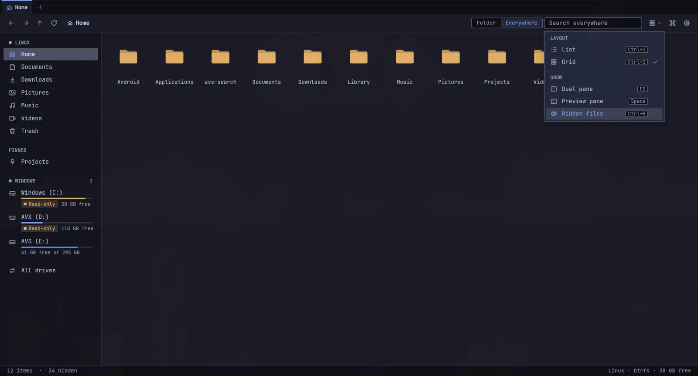
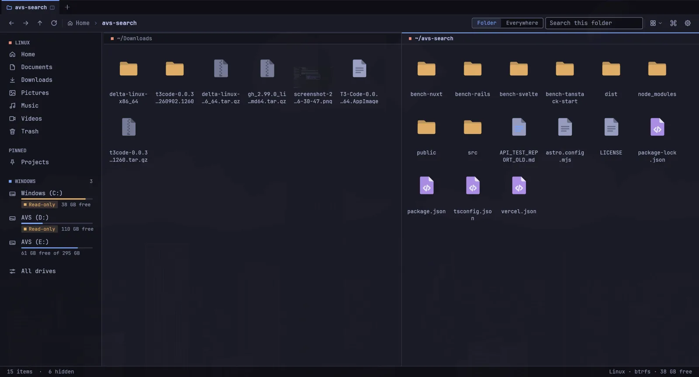
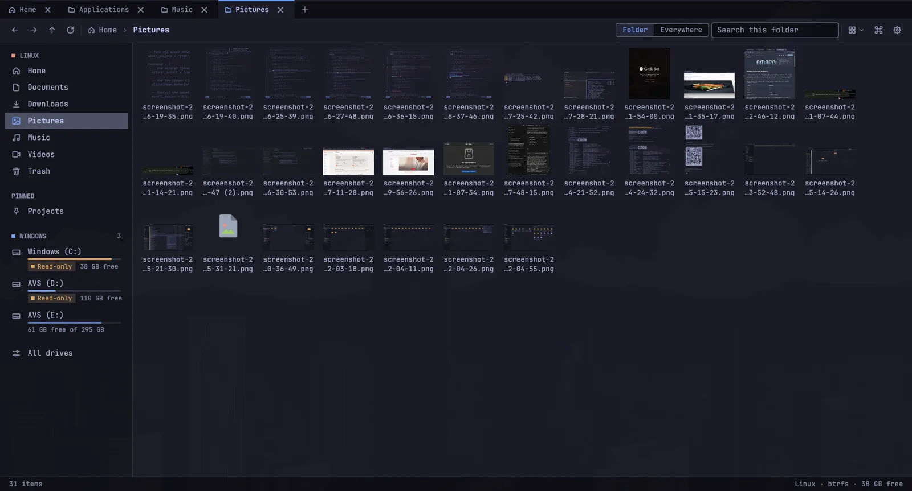
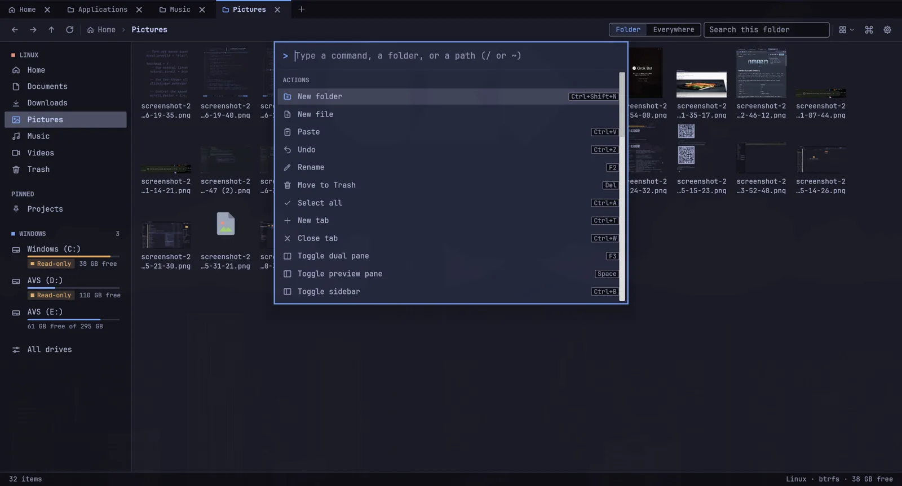

<div align="center">


# EchoFiles

### A faster way through your files.

A native Linux file manager built for fast folders, quick search and hands-on file work.

[Download the latest package](https://github.com/adityavardhansharma/EchoFiles_Linux/releases/latest) · [Browse the code](https://github.com/adityavardhansharma/EchoFiles_Linux) · [See performance details](design/docs/performance-report.html)

</div>

## Get EchoFiles

### Download the package

Open [GitHub Releases](https://github.com/adityavardhansharma/EchoFiles_Linux/releases/latest), download the `.pkg.tar.zst` package and `SHA256SUMS`, then install it on Arch Linux or Omarchy:

```bash
cd ~/Downloads
sha256sum --check --ignore-missing SHA256SUMS
sudo pacman -U ./echofiles-*-x86_64.pkg.tar.zst
```

Open **EchoFiles** from your applications menu, or run `echofiles`. The package also installs the optional `ef` command line tool. Remove it with `sudo pacman -Rns echofiles`.

The package is for Arch Linux and compatible distributions. It installs the app for everyone on the machine. It does not need AUR access. Vulkan drivers are supplied by your graphics driver package; install the driver for your GPU.

### Or build it from a clone

This option builds and installs EchoFiles for your user, without `sudo`:

```bash
git clone https://github.com/adityavardhansharma/EchoFiles_Linux.git
cd EchoFiles_Linux
```

On Omarchy, install the build tools and desktop libraries, then run the installer:

```bash
omarchy pkg add rust pkgconf fontconfig libxkbcommon wayland libx11 libxcursor libxi libxrandr vulkan-icd-loader
bash scripts/install.sh
```

Rust 1.90 or newer is required. If your Rust is managed by rustup, update it with `rustup update stable`. On plain Arch, install the same dependencies with `sudo pacman -S rust pkgconf fontconfig libxkbcommon wayland libx11 libxcursor libxi libxrandr vulkan-icd-loader`, then run the installer. Optional drive mounting uses `udisks2` and `polkit`. Network places use `gvfs` (plus `gvfs-smb` for Windows shares), and finding servers nearby uses `avahi`.

The installer adds the **EchoFiles** app launcher and installs `echofiles` and `ef` in `~/.local/bin`. To update later, run `git pull` in the cloned repository and run `bash scripts/install.sh` again.

## See EchoFiles in action

<table>
<tr>
<td width="50%"><a href="assets/screenshots/echofiles-main.webp"></a><br><b>Focused folder view</b><br>Navigate, sort and switch views from one toolbar.</td>
<td width="50%"><a href="assets/screenshots/echofiles-dual-pane.webp"></a><br><b>Dual pane</b><br>Keep source and destination folders together while moving files.</td>
</tr>
<tr>
<td width="50%"><a href="assets/screenshots/echofiles-grid.webp"></a><br><b>Grid view and previews</b><br>See images and files at a glance.</td>
<td width="50%"><a href="assets/screenshots/echofiles-command-palette.webp"></a><br><b>Command palette</b><br>Find actions from the keyboard with Ctrl+K.</td>
</tr>
</table>

[Search and index settings](assets/screenshots/echofiles-settings.webp)

## Made for everyday file work

- **Open large folders quickly.** Names, sort order and file details are loaded with a parallel, native Rust pipeline.
- **Search by name across indexed folders.** The index maps from disk, supports Unicode and can skip development caches to keep results useful.
- **Use the layout that fits the task.** List, grid, tabs and dual pane are available from the main window.
- **Preview before opening.** Image and text previews, file properties and folder sizes are close at hand.
- **Move with confidence.** Copy, move, rename, trash and undo are built into the file manager.
- **Connect to Windows volumes.** Inspect mounted drives, assign letters and choose when a drive can be written to.
- **Open network places.** Connect to Windows shares (SMB), SSH servers (SFTP) and FTP/FTPS servers from the sidebar's Network section or Ctrl+Shift+S, then browse, copy and rename there like any folder. Addresses such as `smb://nas/Media` or `\\nas\Media` also work in the path bar and from other apps.
- **Use your Android phone over Wi-Fi.** Pair it with the free KDE Connect app (Google Play or F-Droid) — nothing else to install on the laptop. Browse its files and photos, import new photos, send files both ways, share the clipboard, ring it, and see its battery, notifications and texts. See [Connect your phone](#connect-your-phone).
- **Use `ef` from the terminal.** Search an index, narrow results by extension or scope, and pipe paths into other commands.

## Connect your phone

1. Install **KDE Connect** on your Android phone from Google Play or F-Droid and open it. Keep the phone on the same Wi-Fi as the laptop.
2. In EchoFiles, click **Connect phone** in the sidebar's Phone section (or Ctrl+K → *Connect phone*).
3. Pick your phone, check both screens show the same code, and accept on the phone.
4. For files and photos, open the device in KDE Connect, go to **Plugin settings**, turn on **Filesystem expose**, and allow **All files access** when Android asks.

If your phone doesn't appear and the firewall is on (Omarchy enables ufw), use **Allow KDE Connect…** in the dialog, or run:

```bash
sudo ufw allow 1714:1764/udp
```

```bash
sudo ufw allow 1714:1764/tcp
```

EchoFiles speaks the KDE Connect protocol itself, so don't run KDE's own `kdeconnectd` at the same time. Turn features off in Settings → Phone; files the phone sends save to `~/Downloads/Phone`.

## Speed, measured against Nautilus

On a Ryzen 9 4900HS laptop with a warm btrfs cache, the benchmark opened the same folders in EchoFiles and Nautilus 50.2.2. “Content stable” means the listing finished and three consecutive screenshots matched.

| Folder | EchoFiles content ready | Nautilus content ready | EchoFiles RSS | Nautilus RSS | EchoFiles CPU | Nautilus CPU |
|---|---:|---:|---:|---:|---:|---:|
| Small Projects folder | 564 ms | 1.63 s | 141 MB | 287 MB | 110 ms | 570 ms |
| 10,000 files | 575 ms | 1.48 s | 159 MB | 315 MB | 140 ms | 2.13 s |
| 100,000 files | **638 ms** | **10.79 s** | **221 MB** | **416 MB** | **430 ms** | **15.48 s** |

That makes EchoFiles about **17× faster to display the 100,000-file folder**, with **47% less RSS** and **36× less CPU time** in that run. The content timing includes the desktop window animation; the table compares the same machine and setup. These are warm-cache results, not cold-start-after-reboot results.

[Read all the benchmark details, including search against `fd` and `find`](design/docs/performance-report.html).

## The optional `ef` command

The release package and source installer both include `ef`. It searches filenames and directories, not file contents. Search can use EchoFiles' index for indexed locations, or walk a folder live with `--in`.

```bash
# Find names containing “report” in the configured search index
ef find report --limit 20

# Count indexed PDF filenames
ef find '*' --ext pdf --count

# Search a folder directly, including one outside the index
ef find invoice --in ~/Downloads

# Check indexed roots and index status
ef status
```

If `ef` says commands are disabled, open **EchoFiles → Settings → AI agents** and turn on the CLI option. The same switch controls agent access; the command itself runs locally as your user. Use `ef --help` for all options.

## Build a package release

Maintainers can publish versioned Arch packages from **GitHub → Actions → Build and release EchoFiles → Run workflow**. Set the matching version in `Cargo.toml`, commit it, then enter that version in the workflow. It builds an Arch package from the selected source, attaches checksums, and creates a draft release for review. After publishing, the package is available from the Releases page linked above.

## License

EchoFiles workspace crates are GPL-3.0-or-later. Vendored components retain their respective licenses.
