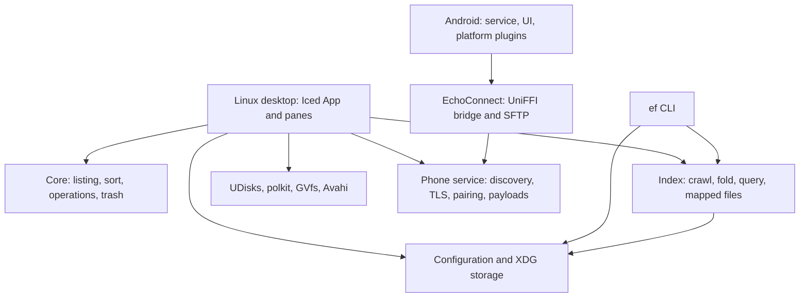

# EchoFiles architecture and performance: the good, the bad, and the ugly

**Review date:** 3 October 2026.  
**Reviewed source:** working-tree snapshot captured at **22:39:33 UTC / 23:39:33 Europe/Dublin**, based on HEAD `16d415b19ed0666fa5cecf4bd3f1401ed9395a20`, including uncommitted desktop and Android work.  
**Scope:** Linux file manager, `ef` CLI, shared indexing/configuration libraries, phone protocol service, EchoConnect Rust bridge, Android service and file-browsing paths, build configuration, and existing performance evidence.

## Overall assessment

EchoFiles has a convincing foundation for a fast Linux file manager. The local browsing path is deliberately designed around compact storage, early display of names, parallel metadata retrieval, and rendering only the visible portion of a folder. Its local filename index also has a coherent design: fold names once, store them compactly, map the saved index into memory, and reuse the same query engine in the GUI and CLI.

The architecture becomes less disciplined as work crosses subsystem boundaries. There is no common owner for background jobs, cancellation, configuration writes, or device sessions. Several parts solve these problems independently; other paths bypass those solutions. The result is an app that can be very fast on the happy path while doing excessive work, showing outdated state, or reporting success too confidently under failure.

The most serious current finding is an incomplete integration of the new file-operation journal. The core preserves replaced files and creates reversible journal entries, but the UI still creates undo actions from destination paths. A disposable-file probe confirmed that this UI-style undo removes the new copy without restoring the old destination. The journal-based undo restores it correctly. This is a concrete example of a good subsystem improvement failing to reach the product boundary.

The correct development priority is to finish those boundaries before adding more features or chasing another small improvement in directory-read speed. Retain the fast listing and index design; make job ownership, persistence, undo, and resource limits equally explicit.

| Area | What is good | What needs attention | Assessment |
|---|---|---|---|
| Local listing and sorting | Compact columns, raw directory reads, cached natural-sort keys | Duplicate listing during metadata load; superseded work keeps running | Strong performance foundation |
| Rendering | List and grid draw visible items with overscan | Selection bookkeeping still scans the full order on updates | Strong renderer, incomplete surrounding optimization |
| Local search | Shared heap/mapped query engine; Unicode folding; scoped subtrees | GUI requests all hits; live exclusions happen after traversal; freshness gaps | Good index, weaker orchestration |
| File operations | Reflinks, kernel copy, staging, preserved replacements, error propagation | UI ignores journal; recovery lifecycle incomplete; new sync costs unmeasured | Improving core, unfinished integration |
| Phone protocol | Connection generations, certificate checks, safer payload publication | Unbounded threads/queues/offers; incomplete shutdown and revocation | Important security progress, insufficient resource control |
| Phone UI and Android | Shared protocol core; platform-specific features stay in Kotlin | Global device state, stale jobs, repeated directory work, JSON cache reparsing | Feature-rich, architecturally immature |
| Verification | Snapshot compiles; 69 existing tests pass | Probes find failures outside current assertions; little sustained-load evidence | Useful tests, insufficient product-level coverage |

## Evidence, limits, and reproducibility

This review distinguishes four kinds of evidence:

- **Measured now:** execution of the snapshot's existing tests and additional disposable-fixture probes.
- **Historical measurement:** results already recorded in the repository, from older builds and explicitly stated workloads.
- **Code finding:** behavior established from the snapshot's implementation, without reproducing the complete user scenario.
- **Inference:** an expected performance or reliability consequence that still needs a targeted measurement.

The working tree was being modified during inspection. An initial test attempt encountered an intermediate missing `tempfile` dependency. The frozen snapshot includes that dependency and builds successfully; the intermediate failure is **not** treated as a defect in the final reviewed snapshot. All source links below point into the snapshot, so later edits do not silently change the evidence.

The final snapshot passed **69 tests** with `cargo test --workspace --locked`, including the phone security regressions. Additional probes used temporary source, destination, configuration, index, and trash directories. They did not operate on real user documents. Android behavior was inspected in source; this report does not claim Android device, APK, battery, or end-to-end interoperability validation.

The host was also running active development and an Android emulator. Consequently, the new JSONL search timing is exploratory and uses the **dev profile**, not a release-performance claim. No fresh GUI comparison, cold-cache benchmark, long-running memory test, or storage-throughput comparison was performed. Existing release binaries were older than the reviewed working tree and were not used to represent the snapshot.

Evidence files:

- [Snapshot metadata and SHA-256 hashes](../../reviews/2026-10-03/architecture-performance/snapshot.json)
- [Workspace test log](../../reviews/2026-10-03/architecture-performance/workspace-tests.txt)
- [Additional probe results](../../reviews/2026-10-03/architecture-performance/probe-results.txt)
- [Probe source](../../reviews/2026-10-03/architecture-performance/probe.rs) and [runner](../../reviews/2026-10-03/architecture-performance/run_probe.py)
- [Measurement environment](../../reviews/2026-10-03/architecture-performance/environment.json)
- [Reproduction instructions](../../reviews/2026-10-03/architecture-performance/README.md)

## Architecture: how the app actually works

### Component boundaries

The workspace contains ten crates. Their names mostly reflect useful responsibilities, although the VFS abstraction is much smaller than its name suggests.

| Component | Responsibility | Important boundary |
|---|---|---|
| `echofiles` / `crates/ui` | Iced app, panes, actions, settings, previews, network and phone views | Coordinates almost every subsystem and owns much of their sequencing |
| `echofiles-core` | Listings, sorting, operations, trash, filesystem information | Local filesystem primitives, independent of Iced |
| `echofiles-index` | Crawling, folding, ranking, saved indexes, live search, `ef` | Main local filename search engine, plus a separate phone JSONL search path |
| `echofiles-config` | Preferences and XDG paths | Used by UI, CLI, and index tooling; saving is a shared correctness boundary |
| `echofiles-disks` | Volume discovery, drive letters, UDisks/polkit interactions | Delegates privileged operations to Linux services |
| `echofiles-vfs` | `Location::Local` and volume identity types | Provides vocabulary, rather than a complete backend capability interface |
| `echofiles-net` | Address parsing, discovery, GVfs mounting | Remote storage becomes a local-looking FUSE path |
| `echofiles-phone` | Discovery, TLS, pairing, packets, payloads, LAN/Bluetooth links | Protocol and authorization shared between desktop and Android |
| `echofiles-theme` | Palette and theme loading | Appearance logic separate from file operations |
| `echoconnect-core` | UniFFI interface and phone-side SFTP service | Rust owns transport; Kotlin owns Android platform features |

This separation is worth preserving. Neither a phone feature nor a UI redesign should require rewriting the listing engine. However, merely putting code in separate crates does not separate ownership or failure handling: most lifecycle decisions still converge in the UI.

The snapshot has a 1,629-line `app.rs`, a 1,929-line desktop `phone.rs`, and a 1,091-line `network.rs`. Size alone is not a bug. Their concentration of UI state, protocol handling, persistence, external commands, and job dispatch is the concern. Refactoring should extract owners of state and work, rather than divide large files into equally coupled smaller files.

Sources: [workspace manifest](../../reviews/2026-10-03/architecture-performance/snapshot/Cargo.toml), [VFS types](../../reviews/2026-10-03/architecture-performance/snapshot/crates/vfs/src/lib.rs), [UniFFI bridge](../../reviews/2026-10-03/architecture-performance/snapshot/crates/connect/src/lib.rs).

### The local browsing path

A pane begins a load with a unique generation. The loader opens the folder, reads names and directory-entry types, builds natural-sort keys, computes display order, and sends a names-only result. It then fills metadata and sends a second result. The UI accepts results only for a matching pane load generation.

The file-list widget computes which rows or tiles intersect the viewport and draws that range plus overscan. Selection uses a bitset, and sort order is a permutation of entry IDs. The app therefore avoids building a widget or allocating an object for every visible directory entry.

There are two distinct performance questions here: how quickly the first useful listing arrives, and how much work continues afterward. The architecture handles the first well. It still eagerly computes metadata for every entry and does not cancel obsolete loads when a user rapidly navigates elsewhere.

Sources: [pane loading](../../reviews/2026-10-03/architecture-performance/snapshot/crates/ui/src/pane.rs#L162), [load acceptance](../../reviews/2026-10-03/architecture-performance/snapshot/crates/ui/src/app.rs#L670), [visible drawing](../../reviews/2026-10-03/architecture-performance/snapshot/crates/ui/src/file_list.rs#L729).

### The search path

The local index crawls names and stores entries in depth-first order. A folder's descendants occupy one contiguous range. Folded names are kept in a byte arena; original names are preserved when they differ from the folded representation. Heap and mapped indexes use the same borrowed query view.

This is primarily a compact scan-based filename index, rather than an inverted index. Searching a broad scope still involves scanning folded data and ranking matches. Its speed comes from contiguous data, optimized substring scanning, precomputed folding, and parallelism above a threshold. Opening a saved mapping also includes a linear validation pass, so “instant opening” should be understood as avoiding a crawl and heap reconstruction, not constant-time work independent of index size.

The GUI loads saved mappings and periodically rebuilds them. A four-thread background pool lowers CPU and I/O priority for crawling and live search. Inotify watches landing folders and visible folders; a full crawl every minute catches other changes. The library has subtree-rescan support, but the GUI's normal `build_all` path rebuilds configured roots.

Phone search follows another design entirely: it reads JSONL files, parses every line, deduplicates paths in a `BTreeMap`, and only then applies filters and a limit. Sharing the `Query` type does not make that path equivalent to the local index in semantics or performance.

Sources: [index layout and crawl](../../reviews/2026-10-03/architecture-performance/snapshot/crates/index/src/lib.rs), [query view](../../reviews/2026-10-03/architecture-performance/snapshot/crates/index/src/view.rs), [background pool and rebuild](../../reviews/2026-10-03/architecture-performance/snapshot/crates/ui/src/indexer.rs), [phone cache search](../../reviews/2026-10-03/architecture-performance/snapshot/crates/index/src/phone.rs).

### Execution and lifetime model

| Work | Execution model | Main limitation |
|---|---|---|
| Listing and metadata | Shared Rayon pool | Old loads are rejected but continue consuming resources |
| Crawling and live search | Dedicated four-thread low-priority Rayon pool | Full rebuilds; live exclusion pruning missing |
| General UI background task | New OS thread through `background()` | No shared concurrency budget, queue, or task owner |
| Normal thumbnails | Two jobs plus a visible-item queue | Helper lifetime, decode bytes, and result freshness need stronger controls |
| Phone connection | Thread per connection; standard unbounded channel | No global connection budget or service shutdown contract |
| Phone payload | Thread per accepted payload or send operation | No shared transfer budget or complete revocation model |
| Android feature work | Fixed pool of three threads | Worker count bounded; queued work can still accumulate |
| Android SFTP | Tokio runtime with two workers | Blocking filesystem operations execute inside async handlers |

A separate executor is not automatically an improvement. Each executor needs a reason to exist, a resource budget, and an owner that cancels or drains its work. EchoFiles currently has several execution models without one consistent policy for these requirements.

Sources: [background helper](../../reviews/2026-10-03/architecture-performance/snapshot/crates/ui/src/app.rs#L208), [phone accept loop](../../reviews/2026-10-03/architecture-performance/snapshot/crates/phone/src/service.rs#L438), [Android worker pool](../../reviews/2026-10-03/architecture-performance/snapshot/android/app/src/main/java/app/echoconnect/Work.kt), [SFTP runtime](../../reviews/2026-10-03/architecture-performance/snapshot/crates/connect/src/sftp.rs#L40).

## The good

### 1. The hottest local data paths are designed deliberately

The listing engine uses `getdents64` through `RawDir`, an arena for filename bytes, and parallel metadata columns. Metadata requests are relative to an already-open directory descriptor, reducing repeated path work. Natural-sort keys are built once, and sorting moves IDs rather than full records. Large sorts can run in parallel.

These choices improve locality and avoid the overhead of independently allocated strings and objects per entry. They also preserve raw Unix filename bytes, including names that are not valid UTF-8. The index tests exercise non-UTF-8 round trips, Unicode folding, ranking, and equivalent results from mapped and heap indexes.

Preserve these representations when simplifying higher-level code. A generic backend abstraction should not force local listings back into thousands of individually allocated objects.

Sources: [listing](../../reviews/2026-10-03/architecture-performance/snapshot/crates/core/src/listing.rs#L76), [sort keys](../../reviews/2026-10-03/architecture-performance/snapshot/crates/core/src/sort.rs#L37), [search tests](../../reviews/2026-10-03/architecture-performance/snapshot/crates/index/tests/search.rs).

### 2. Rendering scales with the viewport

The custom list/grid widget renders a viewport range with overscan. This is the correct design for folders containing tens or hundreds of thousands of entries. Keeping selection in a bitset and sort order in an ID vector avoids attaching mutable UI state to every row.

The existing tests also cover marquee selection and offscreen rows. That is useful product behavior coverage, not merely a check that helper functions return their own intermediate values.

The next improvements should target work surrounding rendering; the renderer already avoids the most obvious large-folder mistake.

Source: [file-list widget and tests](../../reviews/2026-10-03/architecture-performance/snapshot/crates/ui/src/file_list.rs).

### 3. Startup optimizations address measured costs

The app selects an integrated GPU/Vulkan configuration while respecting explicit overrides. It forwards second launches to a running instance. A documented Iced patch loads the UI fonts first and defers the full font database to a background thread.

These are concrete optimizations for actual startup costs. The font patch has a clear explanation and a stated removal condition when upstream supports deferred loading. Its maintenance cost is real: Iced upgrades must preserve the initialization, locking, and text-cache invalidation behavior. A focused startup/fallback-font regression check would protect that benefit.

Sources: [startup](../../reviews/2026-10-03/architecture-performance/snapshot/crates/ui/src/main.rs), [GPU configuration](../../reviews/2026-10-03/architecture-performance/snapshot/crates/ui/src/gpu.rs), [vendor patch notes](../../reviews/2026-10-03/architecture-performance/snapshot/vendor/iced_graphics/ECHOFILES_PATCH.md).

### 4. Local search is shared across the GUI and CLI

The mapped format avoids repeating normalization and copying all name data into each process's heap. Saved indexes are published by rename, so readers can retain the previous mapping while another build is published. Keeping query logic in one borrowed view reduces semantic drift between heap and mapped readers.

Recommended exclusions also make practical sense: package stores and generated caches can dominate filename counts while adding little useful search content. The index records skipped folders themselves where appropriate, so users can still find a folder such as `node_modules` without indexing its entire contents.

The missing piece is a complete publication and freshness protocol across all writers and settings revisions, discussed below.

Sources: [mapped storage](../../reviews/2026-10-03/architecture-performance/snapshot/crates/index/src/store.rs), [query view](../../reviews/2026-10-03/architecture-performance/snapshot/crates/index/src/view.rs), [exclusion options](../../reviews/2026-10-03/architecture-performance/snapshot/crates/index/src/lib.rs#L112).

### 5. Security and file-operation improvements deserve credit

Compared with the older repository review, the snapshot now binds packet authorization to a connection generation and certificate, validates device IDs, expires pairing requests, rejects a different certificate for a trusted identity, and compares outgoing payload certificates with the intended phone. Incoming payloads use random, exclusively created staging files and publish with a no-replace rename. The existing security tests pass.

The file-operation core likewise stages copies before replacing destinations, keeps previous entries in recovery directories, checks filesystem identity for aliases, opens source files without following symlinks, and rejects unsupported copied file types during execution. The fresh probes confirmed that a vanished source preserves the old destination, copying through an alias preserves the original, and a FIFO copy fails without losing the FIFO.

These are substantial improvements. The older review's destructive replacement and silent FIFO-copy behavior should not be repeated as current findings. However, successful improvements in the core do not establish that the GUI's undo and failure messages are correct.

Sources: [connection registration and generation checks](../../reviews/2026-10-03/architecture-performance/snapshot/crates/phone/src/service.rs#L799), [packet authorization](../../reviews/2026-10-03/architecture-performance/snapshot/crates/phone/src/service.rs#L968), [payload publication](../../reviews/2026-10-03/architecture-performance/snapshot/crates/phone/src/service.rs#L1143), [staged operations](../../reviews/2026-10-03/architecture-performance/snapshot/crates/core/src/ops.rs#L458), [probe results](../../reviews/2026-10-03/architecture-performance/probe-results.txt).

## The bad

These are architectural and performance weaknesses. Some also become correctness failures, but their severity depends on workload or completion order.

### B1. Background jobs have no common concurrency budget

`background()` starts an OS thread for each task. Indexed search runs on each text change without a debounce; indexed queries do not consume the live-search cancellation token. Rejected results can therefore leave obsolete CPU, allocation, sorting, and metadata work running. Folder loads similarly reject old generations without cancelling old metadata passes.

The dedicated low-priority crawl pool is good, but it does not cover all this work. In particular, large mapped searches can use the normal Rayon pool, which is also used by foreground listings and sorts. Rapid typing while navigating a large folder can create competition between work the user still needs and work they have already superseded. That contention is a code-based inference, not a measured frame-time regression in this review.

**Change:** introduce bounded worker queues with operation-specific cancellation. Coalesce typing and sort requests, and keep only the newest pending job for each pane. Preserve separate priority for latency-sensitive browsing and bulk indexing. Measure queue length, active jobs, cancellation delay, and obsolete work completed.

Sources: [background helper](../../reviews/2026-10-03/architecture-performance/snapshot/crates/ui/src/app.rs#L208), [search dispatch](../../reviews/2026-10-03/architecture-performance/snapshot/crates/ui/src/app.rs#L528), [query parallelism](../../reviews/2026-10-03/architecture-performance/snapshot/crates/index/src/view.rs#L126).

### B2. Rendering is bounded, but UI update bookkeeping is not

Every app update calls `sync_selection_size()`. In file mode, that obtains `selected_entries()`, which scans the entire display order before selected folders are taken. With 100,000 entries and no selection, this still examines 100,000 IDs. Rendering only 40 rows does not remove that full-folder work from the update path.

A selection revision could make the directory-size calculation depend on selection changes rather than every message. The bitset can also be traversed by set bits, as `selection_stats()` already does. Maintain display ordering only when an action actually requires it.

This is an algorithmic finding. The historical 60 Hz scroll result does not prove the absence of overhead at higher refresh rates, during heavy message traffic, or when phone events arrive rapidly.

Sources: [update and selection-size synchronization](../../reviews/2026-10-03/architecture-performance/snapshot/crates/ui/src/app.rs#L633), [selection traversal](../../reviews/2026-10-03/architecture-performance/snapshot/crates/ui/src/pane.rs#L331).

### B3. Two-phase loading duplicates the whole listing

The loader clones the names-phase `Listing` before sending the first result. The clone duplicates the filename arena and all columns even though the second phase primarily changes metadata. Immutable names and offsets could be shared between phases while metadata is returned separately.

The base columns account for approximately **27 bytes per entry**, plus filename bytes and terminators, before vector spare capacity, sort keys, order, temporary metadata results, and NTFS attributes. A 100,000-entry order vector alone uses about 0.38 MiB. These sizes explain some allocation pressure, but do not explain the entire application RSS. Fonts, rendering caches, mappings, driver allocations, and thumbnails need independent measurements.

**Change:** share immutable listing data, return a metadata result owned by the load generation, and track listing/name-key/cache bytes explicitly. Do not promise a specific RSS saving until measured on the current build.

Sources: [listing columns](../../reviews/2026-10-03/architecture-performance/snapshot/crates/core/src/listing.rs#L76), [listing clone](../../reviews/2026-10-03/architecture-performance/snapshot/crates/ui/src/pane.rs#L203).

### B4. GUI search limits presentation after doing much more work

The GUI displays at most 300 local hits but calls mapped search with `limit: None`, collecting and ranking all matches. It then retains the first available rows. Broad queries can thus allocate and sort results far beyond what the user can see. Results are also combined in configured-root order rather than globally ranked across roots.

Live search has a different waste pattern: it walks a root before the UI wrapper removes results under excluded paths and folder names. It does not apply the configured cache-tag rule while traversing. Excluded trees can still cost I/O, and the results need not match the configured index's cache exclusions.

**Change:** add a search response that returns an exact count and a bounded ranked set, without materializing every match. Apply exclusion policy during traversal. Merge bounded per-root candidates by a shared ranking key if cross-root ranking is intended.

Sources: [GUI indexed search](../../reviews/2026-10-03/architecture-performance/snapshot/crates/ui/src/search.rs#L64), [GUI live filtering](../../reviews/2026-10-03/architecture-performance/snapshot/crates/ui/src/search.rs#L99), [live walker](../../reviews/2026-10-03/architecture-performance/snapshot/crates/index/src/live.rs#L57).

### B5. The phone index does not inherit the local index's strengths

Every phone search reads and parses the cached JSONL entries, inserts all paths into a `BTreeMap`, lowercases paths, and finally limits the result. The GUI invokes that search twice: once for directories and once for general hits. It has no persistent parsed view, no compact folded arena, and no reuse of the local matcher.

Phone search matches a substring in the entire URI/path, uses different normalization, and does not implement the local engine's quoted terms and ranking. A query can match a parent folder or device ID. The GUI adds only returned phone hits to its total, so that total is not the full count of phone matches once a limit applies.

The fresh 10,000-entry JSONL probe returned the top 50 in **52.885 ms median**, with a **52.389–54.327 ms** range over nine timed iterations after warm-up. This dev-profile measurement on a loaded host is not a release latency target. It demonstrates a distinct parse/deduplicate path whose cost is not bounded by the displayed result count.

**Change:** load phone snapshots into a reusable validated structure and share matcher semantics where the product promises equivalent search. Publish complete cache generations atomically, record freshness/device identity, and make counts independent of display limits.

Sources: [phone search](../../reviews/2026-10-03/architecture-performance/snapshot/crates/index/src/phone.rs), [GUI phone merge](../../reviews/2026-10-03/architecture-performance/snapshot/crates/ui/src/search.rs#L126), [append-only phone cache writer](../../reviews/2026-10-03/architecture-performance/snapshot/crates/ui/src/connect.rs#L121), [measurement](../../reviews/2026-10-03/architecture-performance/probe-results.txt).

### B6. Index freshness and settings identity need stronger guarantees

Inotify watches only selected folders, and hidden-only name changes do not trigger the same immediate rebuild path. Other folders depend on the periodic full rebuild. Watcher overflow or watch removal needs explicit recovery rather than reliance solely on ordinary events.

`IndexBuilt` and `IndexOpened` do not carry a settings revision. A result started with an earlier root or exclusion configuration can be installed while newer settings are active. The off-state guard is useful, but it does not distinguish an old build from a newer enabled configuration. Searching any available maps can also omit a configured root whose map is missing, rather than searching that root live or clearly declaring incomplete coverage. A rebuild failure replaces that root's usable map with an error instead of retaining a last-good snapshot.

The saved local index and settings writers also use deterministic temporary names. GUI rebuilds and `ef index` can write the same root's `.tmp` concurrently. This index-writer race was inspected, not reproduced here.

**Change:** tag jobs and published snapshots with a configuration revision, retain last-good mappings on failures, show partial coverage, and use unique temporary files plus a writer protocol. Consider subtree rescans only after correctness is established and full-rebuild cost is measured.

Sources: [watcher](../../reviews/2026-10-03/architecture-performance/snapshot/crates/ui/src/indexer.rs#L157), [index acceptance](../../reviews/2026-10-03/architecture-performance/snapshot/crates/ui/src/app.rs#L1087), [index save](../../reviews/2026-10-03/architecture-performance/snapshot/crates/index/src/store.rs#L37), [GUI map selection](../../reviews/2026-10-03/architecture-performance/snapshot/crates/ui/src/search.rs#L65).

### B7. Thumbnails have a job bound, but incomplete memory and lifetime bounds

Two normal thumbnail jobs run concurrently and obsolete queued requests are replaced by current visible requests. This is good. However, the cache is limited by entry count rather than bytes. At 128 × 128 RGBA, 1,500 images contain about **93.75 MiB of raw pixels**, before image/texture overhead. Cached PNGs can be larger because the cache reader does not resize them, so this is an illustration, not a strict upper bound.

Each in-process decode allows up to 512 MiB through the image decoder's allocation limit. Two permitted jobs therefore do not imply a small memory footprint. External thumbnailers are awaited without a timeout. A hung helper can occupy a slot indefinitely. Their output path uses just one byte of the URI hash, so different files can collide even within the same process.

Results also identify a path without carrying the requested mtime or a job generation back to `done()`. An older completion can be installed against the map's newer timestamp. The completion-order deque is not a full access-based LRU, and duplicate path entries can make eviction remove a newer slot.

**Change:** budget decoded bytes, resize cache reads, use unique output files, impose helper deadlines, and validate completion tokens. Measure CPU image storage and renderer texture storage separately.

Source: [thumbnail cache, decode, and helper execution](../../reviews/2026-10-03/architecture-performance/snapshot/crates/ui/src/thumbs.rs).

### B8. Remote storage is treated too much like local storage

GVfs is an effective way to reuse local browsing and operation code. It also hides latency and capabilities behind a `PathBuf`. `Location` currently has only a local variant, so unsupported or expensive remote operations are decided by scattered special cases instead of a backend contract.

For example, a pane obtains filesystem information before dispatching its listing worker, and a completed phone mount calls `is_dir()` in the UI handler. Filesystem queries against disconnected FUSE mounts can block unpredictably. Ordinary grid thumbnails exclude recognized network paths, while phone photo paths have a separate loading pipeline.

**Change:** describe backend capabilities—latency, metadata cost, atomic rename support, free-space reliability, thumbnail policy, and cancellation—and route blocking remote calls through controlled jobs. Preserve the efficient local engine underneath that interface.

Sources: [VFS](../../reviews/2026-10-03/architecture-performance/snapshot/crates/vfs/src/lib.rs), [pane filesystem query](../../reviews/2026-10-03/architecture-performance/snapshot/crates/ui/src/pane.rs#L173), [phone mount completion](../../reviews/2026-10-03/architecture-performance/snapshot/crates/ui/src/phone.rs#L1175).

### B9. Safer transfers introduce new performance and accounting costs

The new operation engine calls `syncfs` after preparing each staged entry, again before deleting a cross-filesystem move source, and at the end. For a large merged tree or many selected small files, repeated filesystem-wide syncs may dominate throughput and flush unrelated dirty data. This is an expected regression risk, not a measured slowdown. The old comment describing one final sync no longer matches the implementation.

The correctness requirement should remain: never sacrifice the only safe copy to improve benchmark numbers. Investigate durable batching and journal boundaries while preserving that requirement.

A fresh single-file probe also reported **`files_done=2` with `files_total=1`**. The copy path counts the file and `transfer_entry()` increments the same counter again. Accurate progress matters when evaluating transfer performance and communicating remaining work.

Sources: [staging and sync ordering](../../reviews/2026-10-03/architecture-performance/snapshot/crates/core/src/ops.rs#L495), [copy counter](../../reviews/2026-10-03/architecture-performance/snapshot/crates/core/src/ops.rs#L568), [probe results](../../reviews/2026-10-03/architecture-performance/probe-results.txt).

### B10. Android paging repeatedly does whole-directory work

The Android file plugin loads and sorts the full directory for every 500-entry page. Across P pages of N entries, it repeats approximately P whole-directory reads and sorts; P grows with N/500. The wire response is paged, but the backend computation is not incremental or snapshot-based. Mutations between pages can also shift offsets.

The Rust SFTP service has two Tokio workers, but its async handlers use synchronous `std::fs`, `read`, `write`, `seek`, and `sync_all`. Slow storage can occupy those workers. `opendir` gathers metadata for all entries, and `readdir` repeatedly drains from the front of a vector, moving the remaining entries each time.

**Change:** give directory sessions a stable snapshot/cursor with expiry and mutation rules; move blocking filesystem work to a bounded blocking executor; store a position or deque rather than draining a vector prefix. Measure on a real phone with a large camera/download folder before making throughput or battery claims.

Sources: [Android file paging](../../reviews/2026-10-03/architecture-performance/snapshot/android/app/src/main/java/app/echoconnect/files/Files.kt#L25), [SFTP directory and file handlers](../../reviews/2026-10-03/architecture-performance/snapshot/crates/connect/src/sftp.rs#L246).

## The ugly

These are the findings that can break user trust. “Ugly” describes impact, not code style. Confirmed behavior is separated from scenarios that still need reproduction.

### U1. The GUI drops the replacement recovery journal

**Priority: P1. Evidence: reproduced core behavior using the exact undo construction present in the UI; GUI click flow inspected.**

The core returns `Outcome.journal`, including instructions to restore retained previous destinations. `FileMsg::Finished` instead pushes `Undo::Copy` or `Undo::Move` built from `Outcome.done`.

The probe copied `src/x = new` over `dst/x = old`. Replaying the UI's copy undo returned success and trashed the new destination, but `dst/x` was not restored. Replaying `Undo::Journal` restored `old` correctly. The old data remains in a hidden recovery directory; the user-facing undo is incomplete, rather than the original bytes being immediately destroyed.

**Repair:** pass the core journal unchanged into the UI's undo stack. Retain unfinished recovery entries when undo fails. Define cleanup and restart recovery for retained directories, because successful replacements can otherwise accumulate old files with no clear lifecycle. Add a product-boundary replacement-and-undo regression, not just a simple copy/move test.

Sources: [core journal](../../reviews/2026-10-03/architecture-performance/snapshot/crates/core/src/ops.rs#L518), [UI undo construction](../../reviews/2026-10-03/architecture-performance/snapshot/crates/ui/src/actions.rs#L653), [confirmed comparison](../../reviews/2026-10-03/architecture-performance/probe-results.txt).

### U2. Settings writes can fail even though each writer uses rename

**Priority: P1 for reliable preference persistence. Evidence: reproduced at the shared config API; UI bypass inspected.**

`Settings::save_to()` writes the same `.tmp` path on every call. Independent writers can truncate or rename each other's staging file. The Settings screen has an ordering lock, but `persist_settings()` starts independent threads and bypasses it. The configuration crate itself does not enforce writer coordination.

The final probe ran 50 rounds of eight simultaneous saves to a disposable settings file: **293 of 400 saves returned errors**. No malformed final file appeared in those 50 rounds. The error count is scheduling-dependent; an earlier exploratory run produced fewer errors. The confirmed claim is that concurrency can fail, not that this frequency represents ordinary user behavior or that corruption was demonstrated.

**Repair:** one ordered writer for all app preferences, unique staging files, and visible failure handling. Keep chronological revision numbers so an older snapshot cannot overwrite a newer one. If multiple processes may save, define an interprocess policy as well. Atomic publication alone does not order writers or establish crash durability.

Sources: [config save](../../reviews/2026-10-03/architecture-performance/snapshot/crates/config/src/lib.rs#L360), [Settings-screen ordering](../../reviews/2026-10-03/architecture-performance/snapshot/crates/ui/src/settings.rs#L158), [bypassing persistence path](../../reviews/2026-10-03/architecture-performance/snapshot/crates/ui/src/app.rs#L1178), [probe](../../reviews/2026-10-03/architecture-performance/probe-results.txt).

### U3. A corrupt cache header can panic instead of being rejected

**Priority: P1 for availability. Evidence: reproduced against the snapshot library in dev profile.**

The mapped-index parser checks several lengths, but alignment and header arithmetic occur outside a fully checked chain. Setting `root_len` to `u64::MAX` and `excl_len` to zero in a disposable otherwise-valid index triggered a panic inside `MappedIndex::open()`, rather than an `InvalidData` error.

The release profile uses `panic = "abort"`; a reached panic can therefore terminate the process. The exact corrupt-header path was not separately exercised in release, where overflow behavior differs. The defensible result is the demonstrated dev panic plus an incomplete parser arithmetic contract, not an asserted release exploit for the same bytes.

**Repair:** checked conversion, addition, multiplication, and alignment before constructing slices. Treat invalid cache data as disposable and rebuild it. Add fuzz/property coverage for parser rejection and tree/name invariants. Keep the zero-copy format, but make its preconditions explicit and tested.

Sources: [parser arithmetic](../../reviews/2026-10-03/architecture-performance/snapshot/crates/index/src/store.rs#L128), [release profile](../../reviews/2026-10-03/architecture-performance/snapshot/Cargo.toml), [probe](../../reviews/2026-10-03/architecture-performance/probe-results.txt).

### U4. Phone state and background results lack consistent device ownership

**Priority: P1 for cross-device privacy and action routing. Evidence: code finding; two-real-phone scenario not reproduced.**

`PhoneState` tracks devices by ID, but keeps one notification collection, SMS thread map, mount, and photo collection. SMS and SFTP handlers discard the originating ID. Mount/photo completion messages do not carry a device/session generation. Selecting another phone changes `current` without a complete per-device state switch.

Consequently, data from one device can be shown while another is selected, and replies derive their destination from current state. A mount or photo scan that finishes after disconnect can also repopulate state without proving that the originating session is still relevant. These risks are separate from the now-improved connection-level certificate checks.

**Repair:** `DeviceState` keyed by authenticated device ID, with a session generation and cancellation owner. Carry device/session identity through every result and action. Reject and clean up late results. Apply feature settings at event acceptance, not just at the initiating button; the SFTP event path currently mounts a successful offer without checking the files switch there.

Sources: [global phone state](../../reviews/2026-10-03/architecture-performance/snapshot/crates/ui/src/phone.rs#L105), [late mount acceptance](../../reviews/2026-10-03/architecture-performance/snapshot/crates/ui/src/phone.rs#L1175), [SMS and SFTP handling](../../reviews/2026-10-03/architecture-performance/snapshot/crates/ui/src/phone.rs#L1619).

### U5. The legacy photo-import path records success before copying

**Priority: P1 for reliable import. Evidence: code finding; failed real-phone import not reproduced.**

For photos accessed through the mounted KDE Connect storage path, `PhoneMsg::Import` inserts import markers and saves them before starting file-copy tasks. A cancelled, failed, or disconnected transfer can therefore leave a photo classified as imported even though the local copy was never confirmed.

The new EchoConnect payload branch behaves better: its import marker is added after a successful transfer. The defect is the remaining mounted-storage branch, not every import path.

**Repair:** mark each photo imported from its successful operation outcome. Include device/source identity in the import key. Keep failures eligible for retry, and persist markers through an ordered writer. Test both import implementations under cancellation and disk-full failure.

Sources: [early mounted-photo markers](../../reviews/2026-10-03/architecture-performance/snapshot/crates/ui/src/phone.rs#L1288), [payload completion path](../../reviews/2026-10-03/architecture-performance/snapshot/crates/ui/src/phone.rs#L1801).

### U6. Network-visible work can grow without a hard bound

**Priority: P1 for availability and resource containment. Evidence: code finding; hostile load was not generated.**

The phone service creates a thread for each accepted connection and for discovery-triggered outgoing attempts. Pending attempts are not globally bounded. Connection queues are unbounded, offers accumulate without an overall quota/expiry policy, and accepted payloads spawn new workers. Per-read timeouts and maximum packet lengths are useful but do not impose a total work or lifetime limit on a peer that makes incremental progress.

The service also lacks an explicit stop/join contract. Listener and announcement threads retain shared state. On Android, destroying `ConnectService` stops some platform helpers but does not visibly shut down the Rust core. Both availability and battery behavior need a defined lifetime owner.

Forgetting a peer marks links unpaired but does not remove its stored offers. A subsequent `accept_file()` uses the captured offer certificate without rechecking current pairing. That queued-offer revocation gap is a code finding, not a reproduced post-unpair download in this review.

**Repair:** bound connections, pending discoveries, packet queues, offers, payload bytes, and concurrent transfers. Enforce whole-handshake/session deadlines and cancel work when trust is revoked. Add `stop()` with owned cancellation and worker cleanup, plus tests for flood resistance and start/stop cycles. Every network resource limit should also protect ordinary file browsing, because the service shares the desktop process.

Sources: [listeners and announcements](../../reviews/2026-10-03/architecture-performance/snapshot/crates/phone/src/service.rs#L438), [discovery dispatch](../../reviews/2026-10-03/architecture-performance/snapshot/crates/phone/src/service.rs#L715), [offer acceptance](../../reviews/2026-10-03/architecture-performance/snapshot/crates/phone/src/service.rs#L654), [forget](../../reviews/2026-10-03/architecture-performance/snapshot/crates/phone/src/service.rs#L957), [Android service teardown](../../reviews/2026-10-03/architecture-performance/snapshot/android/app/src/main/java/app/echoconnect/ConnectService.kt#L71).

## Performance evidence: what the numbers support

### Historical GUI comparison with Nautilus

The repository's 26 September results used a Ryzen 9 4900HS, NVMe btrfs, Omarchy/Hyprland, warm page cache, one discarded warm-up, and three timed runs. “Content stable” meant three matching screenshots and included desktop animation.

| Folder | EchoFiles content stable | Nautilus content stable | EchoFiles RSS | Nautilus RSS | EchoFiles CPU | Nautilus CPU |
|---|---:|---:|---:|---:|---:|---:|
| Small Projects folder | 564 ms | 1,627 ms | 141 MB | 287 MB | 110 ms | 570 ms |
| 10,000 files | 575 ms | 1,481 ms | 159 MB | 315 MB | 140 ms | 2,130 ms |
| 100,000 files | 638 ms | 10,787 ms | 221 MB | 416 MB | 430 ms | 15,480 ms |

For that 100,000-file run, the recorded timings imply approximately **16.9× faster content stability**, **46.9% lower RSS**, and **36× less CPU time**. This supports the design's historical warm-cache advantage on that fixture. It does not establish the same ratios for the current snapshot, cold storage, every media folder, or remote mounts.

The recorded internal 600-frame scroll test had p50 16.67 ms, p99 17.5 ms, and maximum 17.8 ms on a 60 Hz display. This shows that that build sustained the test's refresh cadence. It is not a measurement of spare rendering capacity or 120/144 Hz behavior.

Source: [original results and method](../../bench/RESULTS.md), [raw historical results](../../bench/results.json).

### Historical comparison with Flea

The 27 September field benchmark recorded faster mapping and CPU-idle settling for EchoFiles, but Flea used less window PSS in the 100,000-text-file fixture: **157.5 MiB versus EchoFiles' 207.9 MiB**. “EchoFiles uses less memory” is therefore not a general conclusion across competitors.

The media fixtures were not equivalent work: Flea produced 31 thumbnails and EchoFiles produced 18 during timed runs. Their settle/CPU numbers must not be ranked as if both completed the same thumbnail workload. The separate capability pass showed both produced seven tested image/video formats; it did not establish equal thumbnail throughput.

The same-fixture EchoFiles backend medians were **23.89 ms names**, **38.23 ms names plus all metadata**, and **3.17 ms name sorting**. Flea's metadata phase covered its first 350 rows rather than EchoFiles' full folder. Compare definitions before comparing values.

Source: [Flea field methodology and results](../../bench/FLEA.md), [raw runs](../../bench/flea-field-results.csv).

### Fresh findings from this review

| Check | Snapshot result | What it establishes |
|---|---|---|
| Existing workspace tests | 69 passed; zero failures | Current assertions pass on the frozen source |
| Replacement using UI-style undo | Old destination not restored | Journal integration gap, despite successful undo message |
| Replacement using core journal | Old destination restored | Core journal can perform the required restoration in the fixture |
| Source disappears after planning | Old destination preserved; one error | Staging improves failed replacement safety |
| Copy through a directory alias | Original preserved; one completed destination | Filesystem-identity handling improves alias safety |
| Copy a FIFO | One execution error; source preserved; no destination | Unsupported copy is no longer silently successful |
| Copy one ordinary file | Done counter 2; total counter 1 | Progress accounting overcounts |
| Malformed mapped header | Panic caught in dev | Invalid cache parsing is not fully fallible |
| Eight concurrent settings writers, 50 rounds | 293 save errors / 400 attempts; zero malformed final files | Shared staging-name concurrency failure; corruption not demonstrated |
| Phone JSONL, 10,000 entries, top 50 | 52.885 ms median; 52.389–54.327 ms range | Exploratory dev-profile parse/filter latency; not a release or GUI claim |

The historical GUI numbers and fresh phone-cache timing have different builds, workloads, and timing boundaries. They should not appear on a common performance leaderboard.

## What to fix first

| Priority | Work | Completion criterion |
|---|---|---|
| P1 | Connect UI undo to the operation journal and define recovery cleanup | Replacement, merge, partial failure, and restart tests preserve unrelated data and restore prior destinations |
| P1 | Centralize configuration writes | Settings-screen and sidebar changes share one ordered writer; concurrent publication never uses a shared staging file |
| P1 | Make index parsing fully fallible | Truncated/oversized/malformed inputs return errors; parser fuzzing finds no panic or invalid slice |
| P1 | Separate phone state per device/session | Switching/disconnecting devices cannot misroute replies or accept obsolete mounts/results |
| P1 | Bound phone resources and implement shutdown/revocation | Flood and queued-offer tests stay within explicit budgets; stopped services release listeners/workers |
| P1 | Complete legacy photo-import outcome handling | Failed or cancelled imports remain retryable and cannot be marked successful |
| P2 | Add per-job revisions, cancellation, and bounded execution | Rapid typing/navigation leaves bounded pending work and cannot install obsolete results |
| P2 | Reduce update-path selection scans and broad-query allocations | Cost scales with changed selection/displayed candidates rather than full folder/match count where feasible |
| P2 | Fix progress accounting and benchmark the new sync strategy | Counters agree with planned units; small-file and cross-filesystem safety/throughput are measured together |
| P2 | Rework phone-cache search and Android directory sessions | Stable pages, consistent matcher behavior, cached parsing, bounded storage work |
| P2 | Strengthen thumbnail memory/helper ownership | Byte budget, unique files, deadlines, and freshness tokens hold under rapid scrolling and changed files |
| P3 | Broaden benchmark coverage and desktop CI | Repeatable release baseline, cold-cache/remote/long-session checks, full workspace checks on desktop PRs |

A bounded task coordinator, an ordered settings writer, per-device state, and a core-owned operation journal would remove classes of failures. These changes offer more value than isolated fixes to individual callback races.

## Performance validation to add next

Measure the current release build only after the P1 integration work is complete. Record source hashes, build flags, allocator, GPU/backend, storage/filesystem, cache state, fixture counts, active load, and thumbnail formats. Preserve raw runs and report distributions rather than a single best run.

1. **Startup:** separate process launch, window mapping, first frame, names ready, metadata ready, and fallback-font readiness. Measure both a new process and a forwarded launch.
2. **Large folders:** 1k/10k/100k/1M entries where practical, list and grid, multiple panes/tabs, several filename shapes, and rapid navigation. Collect p50/p95/p99 frame and input latency plus obsolete work completed.
3. **Memory:** RSS, PSS, private anonymous memory, mapped index bytes, listing/sort allocations, decoded pixel bytes, and texture estimates. Log several hours of repeated navigation and a 24-hour background session.
4. **Search:** rare/common/one-letter queries, multiple roots, missing maps, Unicode and non-UTF-8 names, changed exclusions, live traversal, and phone snapshots. Measure input-to-result latency, candidate count, queue depth, and cancellation delay.
5. **Transfers:** many small files, large files, merges, replacements, same/cross-filesystem moves, NTFS and GVfs where available. Measure planning, data movement, publication, and sync separately. Validate cancellation, disk-full, source changes, and metadata preservation alongside throughput.
6. **Phone/Android:** multiple devices, large photo libraries, repeated pages, poor Wi-Fi, Bluetooth fallback, trust revocation, start/stop cycles, idle screen-off operation, and bounded resource stress. Measure battery and wakeups on devices rather than infer them from desktop CPU.

The existing `bench` scripts and Divan benches are useful starting points. Desktop CI should also run the complete Rust workspace checks for relevant desktop changes; the snapshot's Android workflow covers only selected paths and does not provide a general desktop regression gate.

Sources: [listing benches](../../reviews/2026-10-03/architecture-performance/snapshot/crates/core/benches/listing.rs), [index benches](../../reviews/2026-10-03/architecture-performance/snapshot/crates/index/benches/search.rs), [Android workflow](../../reviews/2026-10-03/architecture-performance/snapshot/.github/workflows/android.yml).

## Final judgment

**The good:** the local engine, renderer, and mapped filename index show careful performance work, supported by credible historical warm-cache measurements. Recent peer-authentication and staged-copy improvements are meaningful and should be retained.

**The bad:** the app lacks consistent ownership of jobs, writers, device sessions, and backend capabilities. Several paths do substantially more work than the UI displays, and the current safer operation engine introduces durability costs that have not yet been benchmarked.

**The ugly:** green tests coexist with confirmed undo, settings-concurrency, parser, and progress defects, plus inspected cross-device, import, resource, and revocation risks. EchoFiles needs a stronger product-level correctness contract around its fast components before its architecture can be called robust.
